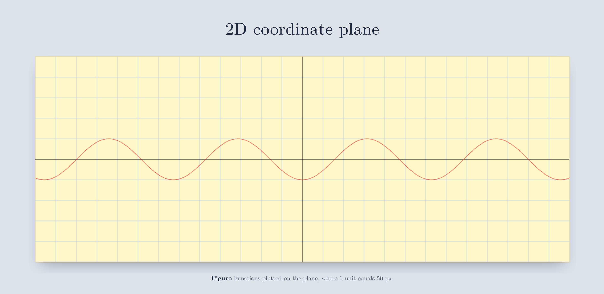
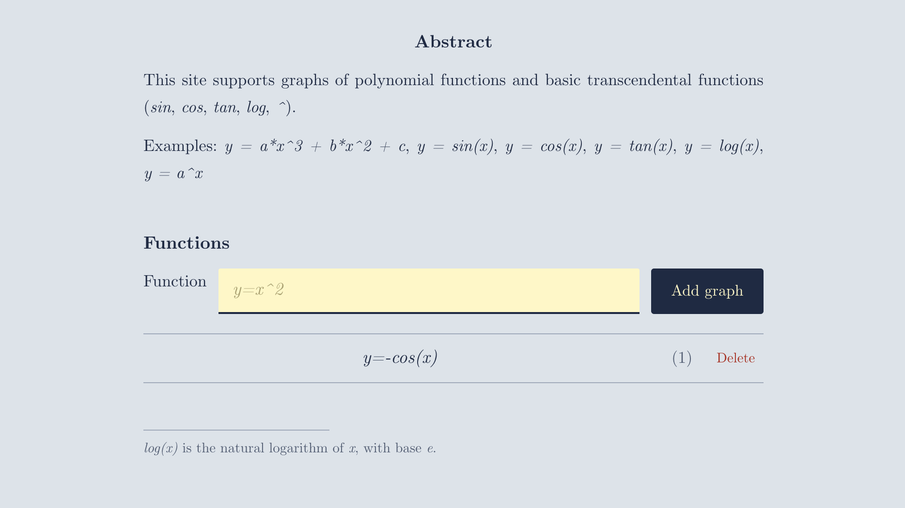

# Graph Plotter

수식을 입력하면 2D 좌표평면에 그려주는 웹 애플리케이션입니다. 직접 구현한 토크나이저와 파서로 수식을 파싱하고, Canvas API로 그래프를 그립니다. 그린 그래프는 서버에 저장됩니다.





## 기능

- 다항함수와 기본 초월함수(`sin`, `cos`, `tan`, `log`, `^`) 그래프 그리기
- 여러 그래프를 겹쳐서 그리기 (그래프마다 다른 색상 자동 지정)
- 그래프 목록 조회, 추가, 삭제 (서버에 저장)
- `tan`, `log`처럼 불연속인 지점에서 선 끊어 그리기
- 잘못된 수식 입력 시 오류 메시지 표시

## 지원하는 수식

| 종류 | 예시 |
| --- | --- |
| 다항함수 | `y = a*x^3 + b*x^2 + c` |
| 삼각함수 | `y = sin(x)`, `y = cos(x)`, `y = tan(x)` |
| 로그함수 | `y = log(x)` |
| 지수함수 | `y = a^x` |

`log(x)`는 밑이 자연상수 `e`인 자연로그입니다.

## 실행 방법

```bash
git clone https://github.com/<your-id>/<repo>.git
cd <repo>
./gradlew bootRun
```

브라우저에서 `http://localhost:8080` 으로 접속합니다.

## API

| 메서드 | 경로 | 설명 | 요청 본문 | 응답 |
| --- | --- | --- | --- | --- |
| `POST` | `/api/graphs` | 그래프 저장 | `{ "expression": "y=sin(x)" }` | `{ "id": 1, "graph": "y=sin(x)" }` |
| `DELETE` | `/api/graphs/{id}` | 그래프 삭제 | - | `204 No Content` |

첫 화면의 그래프 목록은 서버가 템플릿으로 렌더링하고, 이후의 추가·삭제는 JavaScript가 처리합니다(점진적 향상).

## 프로젝트 구조

```
src/main/resources/
├── static/
│   ├── css/
│   │   └── graph.css          스타일
│   └── js/
│       ├── tokenizer.js       수식 문자열 → 토큰
│       ├── parser.js          토큰 → 구문 트리
│       ├── calculate.js       구문 트리 + x값 → y값
│       ├── coordinate.js      좌표평면(축, 격자) 그리기
│       ├── plotter.js         그래프 그리기, 목록 추가·삭제
│       └── errors.js          ExpressionError 정의
└── templates/
    └── graph.html             메인 페이지
```

## 동작 원리

1. **토큰화** — 입력한 문자열을 숫자, 변수, 연산자, 함수 이름 같은 토큰으로 나눕니다.
2. **파싱** — 토큰을 연산자 우선순위에 따라 구문 트리로 만듭니다.
3. **계산** — `x`를 `0.01` 간격으로 바꿔가며 트리를 순회해 `y`값을 구합니다.
4. **그리기** — 좌표값을 캔버스 픽셀 좌표로 변환해 선으로 잇습니다. 값이 유한하지 않거나 화면을 크게 벗어나면 선을 끊습니다.

좌표평면은 1300 × 500 픽셀이고, 원점은 (650, 250), 1 단위는 50픽셀입니다. 따라서 표시 범위는 x는 -13 ~ 13, y는 -5 ~ 5 입니다.

## 화면 구성

논문에서 쓰는 Computer Modern 폰트를 사용하고, 좌표평면은 노트 종이 느낌의 연한 노란색으로 표현했습니다. 그래프 목록에는 논문의 수식 번호처럼 (1), (2) … 번호가 붙습니다.

## 만든 것

- 수식 토크나이저와 재귀 하향 파서 직접 구현
- Canvas API로 좌표평면과 곡선 렌더링
- REST API 연동 및 실패 시 화면 되돌리기 처리